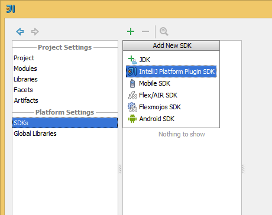

Developing
===========

The following build steps are used by developers.

Pre-Requisites
---------------

#### Tools
The following developer tools are required

- [IntelliJ 13](http://www.jetbrains.com/idea/) 
- [IntelliJ 13 sources](https://github.com/JetBrains/intellij-community)
- [Java 1.7 SE JDK](http://www.oracle.com/technetwork/java/javase/index.html)
- [Scala 2.10.3](http://www.scala-lang.org/download/)
- [Maven 3.0](http://maven.apache.org/) 
- [SBT](http://www.scala-sbt.org/)
	

#### Plugins
The following IDEA plugins are beneficial to install 

- Plugin DevKit - Offers additional tooling for plugin developers, this should be bundlded by default
- Grammar-Kit - Provides support for EBNF-esque grammars and jflex support
- Scala - This plugin is currently developed using the Scala language
- PsiViewer - Visualisation tools for viewing a File's PSI (Program Structure Interfaces) elements

Note the SBT plugin is *not* required, as we currently use `sbt gen-idea` to generate IntelliJ's required *.iml files

Building
------------------

This application makes use of both [Maven 3.0](http://maven.apache.org/)  and [SBT](http://www.scala-sbt.org/) to manage both dependencies and interacting with the [CI server](http://en.wikipedia.org/wiki/Continuous_integration).

##### Installing IDEA Dependencies

In order to make use of IDEA jar dependencies they must be accessible within a repository, this could be offered via a publically hosted repository such as Nexus - however Jetbrains do not *currently* provide such a resource. As such the following may be used to install the dependencies to a local `.m2` folder.

The following scala script has been created to make this process smoother.
Note this script relies on both `mvn` and `scalac` being available on the system path. You can ensure this by running `mvn -version` and `scalac -version` respectively.

	   > cd ${project_root}\plugin\src\main\scala\dsl
	   > mkdir build
	   > scalac -d build InstallDependencies.scala
       > scala -classpath build InstallDependencies "133.139" "C:\Program Files (x86)\JetBrains\IntelliJ IDEA 13.0"
       > Installing ...
       > ...
       > [INFO] >------------------------------------------------------------------------
	   > [INFO] BUILD SUCCESS
       > [INFO] ------------------------------------------------------------------------

Expected Inputs:

- version
- path

*Notes* - This installer places all dependencies under their respective version number. No attempt is made to 'share' common resources, simply due to the lack of meta-data within jar dependencies.

##### SBT

The Scala Built tool offers the ability to run tests from the command line using `sbt test`. However, the following system environment variables are required within the build tools -

- intellijPath - Used to denote the root testing location. An example value would be `C:\Users\a\.IntelliJIdea13` 

### Running Tests

Tests can be executed both within IntelliJ using JUnit, or externally using `sbt test`. Please see the appropriate [CI documentation](build.md)  for further details on how to use `sbt test`.
If you are running windows, an important step is to ensure that you have placed the windows file system dlls into the correct directory.

Installation Steps 
------------------
	
After the Intellij JAR dependencies have been installed within an accessible Maven/SBT repository it is possible to use the following command to generate the required *.iml files for an intellij project.

Note SBT should, by default, check dependencies located within your configured `.m2` folder. This configuration detail also has been added to the sbt file.

	> sbt gen-idea

You should now be able to open your project within IntelliJ as a normal project.

By default gen-idea will generate a plugin structure which is a JAVA_MODULE. However, the dev-kit plugin (which brings extra tooling for plugin developers) relies on the module type being PLUGIN_MODULE.

Edit the `./idea_modules/StaticAnalysis.iml` file to contain the following header information. Note - when you edit your iml file within IntelliJ you should be given reload confirmation.

	   <module type="PLUGIN_MODULE" version="4">
        <component name="DevKit.ModuleBuildProperties" url="file://$MODULE_DIR$/src/main/resources/META-INF/plugin.xml" />

##### Update the JDK

Ensure that you are using the intellij SDK within your project. This menu is accessible with `ctrl+alt+s`

