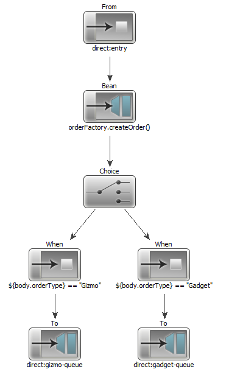
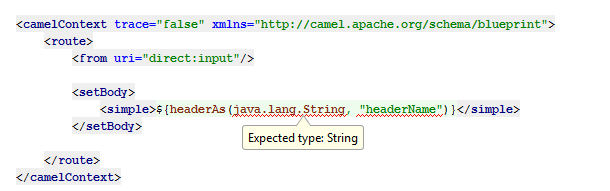
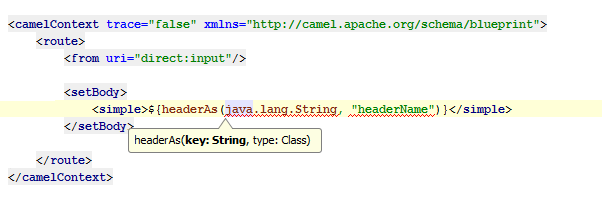
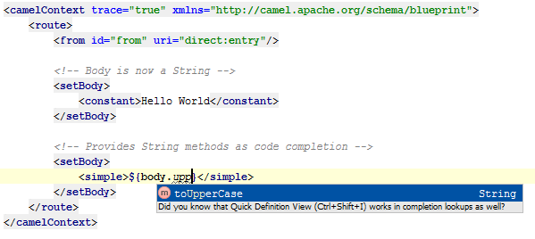

###### Note - This Apache Camel Plugin is *not* currently available within the IntelliJ plugin repository

This project aims to provide developer tooling for [Apache Camel](http://camel.apache.org/), an integration library, in order to provide first-class support within [IntelliJ](http://www.jetbrains.com/idea/), an enterprise Java IDE developed by Jetbrains.

This is achieved by applying static analysis in order to provide intelligent code completion, type checking, renaming support, smart-code navigation and type checking. All of which are associated with  increasing the productivity, efficiency and experience of developers.

## Apache Camel

Apache Camel is an open source integration framework which provides various DSLs (Domain Specific Languages) in order to construct a complex pipeline of processors, which each attempt to handle a message which passes through a given camel route. This message contains information such as `headers` and a `body`.

These processors each provide a level of functionality, such as manipulating the message in a meaningful way - ie extracting or enriching information. More complex processors can call external web services or make choices for instance.

An example of the Apache Camel XML DSL can be seen below

	<route>
		<from uri="direct:entry"/>

		<bean ref="orderFactory" method="createOrder" />

		<choice>
			<when>
				<simple>${body.orderType} == "Gizmo"</simple>
				<to uri="direct:gizmo-queue" />
			</when>
			<when>
				<simple>${body.getOrderType} == "Gadget"</simple>
				<to uri="direct:gadget-queue" />
			</when>
		</choice>
	</route>

When providing complex routing logic, a `choice` element is used - which is semantically equivalent to a series of if statements. Each `when` processor has an associated predicate which resolves to true or false. Such predicates are provided via Expression Languages that are built in to Apache Camel. 

The Simple language is one such expression language, which supports object manipulation and relational expressions, `${body.getOrderType} == "Gadget"}`. 

Within the context of Enterprise Integration Patterns, the previous XML DSL could be visualised as the following - 

	

Before / After
--------------

By default there is no tooling available for Apache Camel. This tooling provides support for both Apache Camel's Simple Language and provides support for code completion within processors.

#### Simple Language Support
For instance consider the following scenario in which a Simple function is being called, however the arguments are reversed.

Such a mistake would not be known about until either runtime or deploy time, and the worst time to find out about mistakes is within production!

	

	*Without the plugin - plain text language support*

After the plugin has been installed we can see the problem more clearly with syntax highlighting and type checking working successfully

	

	*With the plugin - The argument's type information is wrong!*

	

	*After using `ctrl+p` we can see that our arguments are backwards!*

#### Intelligent Type Information Propagation

This tooling analyses the information which is available to the user at a given point in the DSL. 

	

	*Inferred Type Information*

