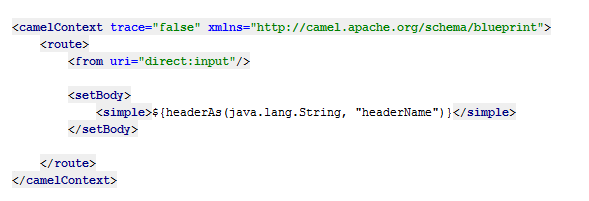

This project aims to provide provide additional developer tooling for [Apache Camel](http://camel.apache.org/), an integration library, in order to provide first-class support within [IntelliJ](http://www.jetbrains.com/idea/), an enterprise Java IDE developed by Jetbrains.

This is achieved by applying static analysis in order to provide intelligent code completion and type checking.

## Apache Camel

Apache Camel is an open source integration framework which provides various DSLs (Domain Specific Languages) in order to allow construct a complex pipeline of processors which can handle information appropriately.

This plugin provides support for the XML DSL provided by Apache Camel, which can be seen below

     <route>
        <from uri="direct:input"/>
        <choice>
            <when>
                <simple>${body.age} < 3</simple>
                <to uri="direct:freeEntry"/>
            </when>
            <when>
                <simple>${body.age} < 18</simple>
                <to uri="direct:childFare"/>
            </when>
            <when>
                <simple>${body.age} > 65</simple>
                <to uri="direct:oapFare"/>
            </when>
            <otherwise>
                <to uri="direct:adultFare"/>
            </otherwise>
        </choice>
    </route>

Within the context of Enterprise Integration Patterns, the above could be visualised as the following - 

    

Before / After
--------------

By default there is no tooling available for Apache Camel's simple, for instance consider the following scenario in which a Simple function is being called with the arguments reversed. 

Such a mistake would not be known about until either runtime or deploy time, and the worst time to find out about mistakes is within production!

	

	*Without the plugin - plain text language support*

After the plugin has been installed we can see the problem more clearly with syntax highlighting and type checking working successfully

	

	*With the plugin - The argument's type information is wrong!*

	

	*After using `ctrl+p` we can see that our arguments are backwards!*

